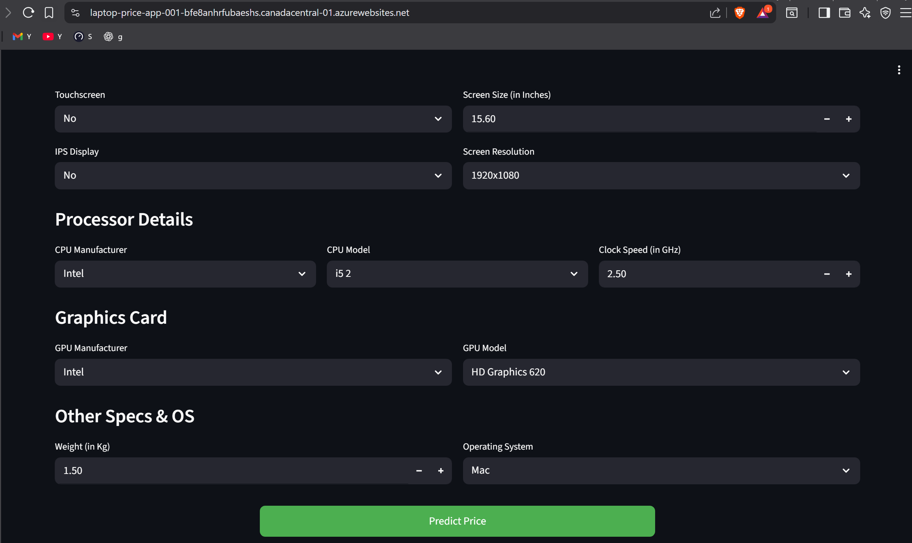
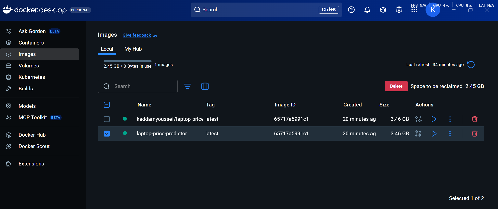
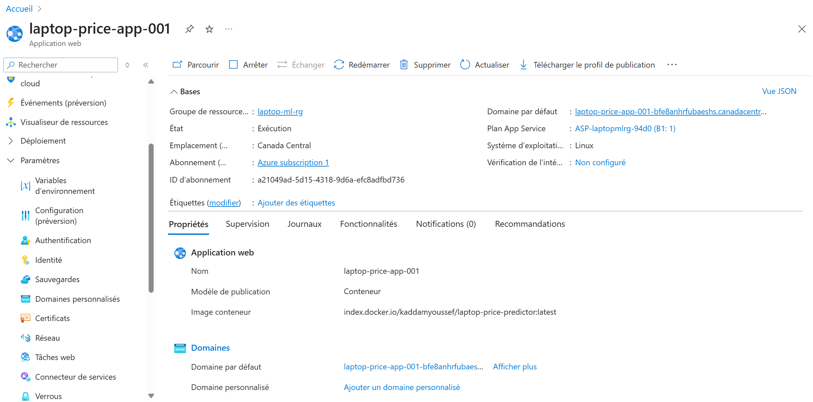

## 💻 Laptop Price Predictor

A Machine Learning web application that predicts laptop prices based on hardware specifications.
Built with Python, Scikit-Learn, Streamlit, Docker, and Azure Cloud.

___

## 📂 Project Structure

├── app.py                         # Streamlit web application

├── Laptop_Prediction_Project.ipynb # ML training & evaluation notebook

├── pipe.pkl                       # Trained ML model

├── df.pkl                         # Preprocessed dataset for prediction

├── laptop_price.csv               # Original dataset

├── Dockerfile                     # Docker container configuration

├── requirements.txt               # Python dependencies

└── README.md                      # Project documentation

___

## 🚀 Run Locally

1. Install dependencies:

pip install -r requirements.txt

2. Start the app: 

streamlit run app.py

App will run at:
👉 http://localhost:8501/

___

## 🐳 Docker Usage

1. Build the Docker image:

docker build -t laptop-price-predictor .

2. Run the container:

docker run -p 8501:8501 laptop-price-predictor

___

## ☁️ Azure Deployment (Docker Container)

1. Create an Azure Web App → Container

2. Use Docker Hub image:

kaddamyoussef/laptop-price-predictor:latest

3. Add App Setting:

WEBSITES_PORT = 8501

___

## 🛠 Tech Stack

Python, Pandas, NumPy

Scikit-Learn, XGBoost

Streamlit

Docker

Azure App Service

___

___

## 👤 Author
KADDAM Youssef

GitHub: https://github.com/kaddamyoussef

